# 🌍 Roamly - Experience Booking Platform

Roamly is a full-stack travel experience booking platform where users can explore adventures, book slots, and make secure payments online.

## 🌐 Live Demo

https://roamly-h1t2.onrender.com/

---

## Features

### ✨ User Features

- Browse experiences without login
- Search experiences
- View complete experience details
- User registration and login
- Slot-based booking system
- Date and time selection
- Razorpay payment integration
- Real-time slot reduction after booking
- My Bookings dashboard
- Secure logout functionality

---

### 🛠️ Admin Features

- Admin authentication
- Add new experiences
- Edit and delete experiences
- CSV import for bulk experience upload
- Revenue and booking analytics
- View all bookings
- Export booking data as CSV

---

## 🚀 Tech Stack

### Frontend
- EJS
- CSS
- JavaScript

### Backend
- Node.js
- Express.js
- MongoDB
- Mongoose
- Express Session
- Razorpay
- bcrypt

---

## 🔑 Admin Credentials

```bash
Email: ayeshansari124@gmail.com
Password: ayesha
```

---

# 📸 Screenshots

## 👤 User Side

### 🏠 Homepage
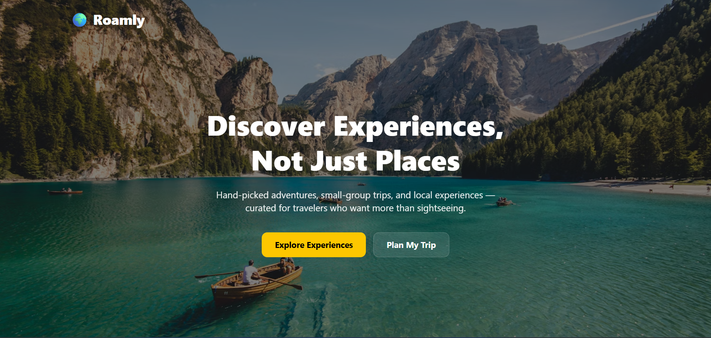

---

### 🌍 Explore Experiences
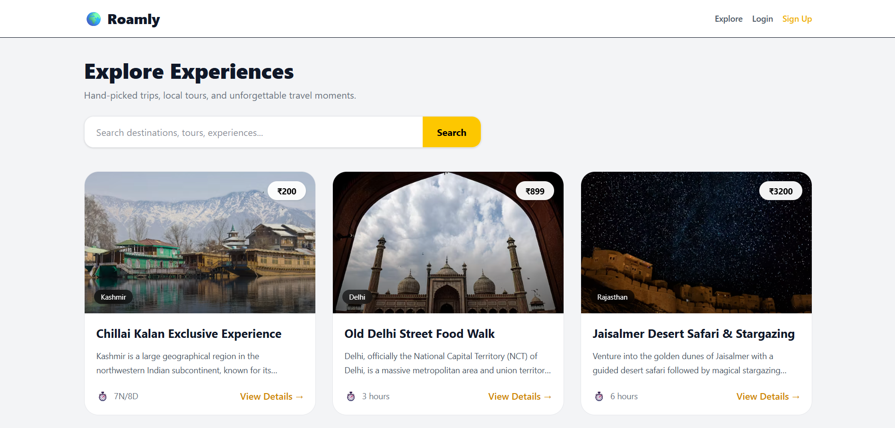

---

### 🔍 Search Experiences
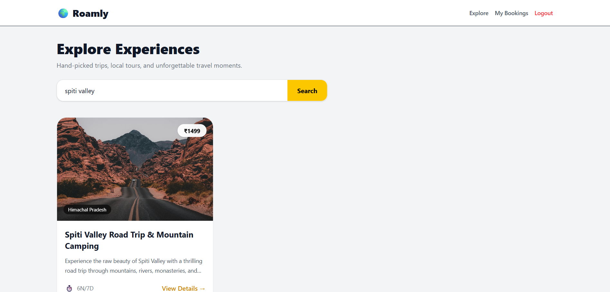

---

### 📖 Single Experience Page
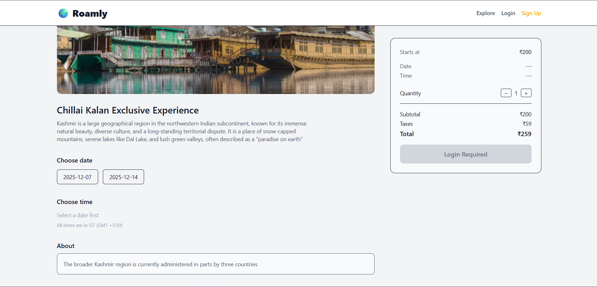

---

### 🔐 Authentication
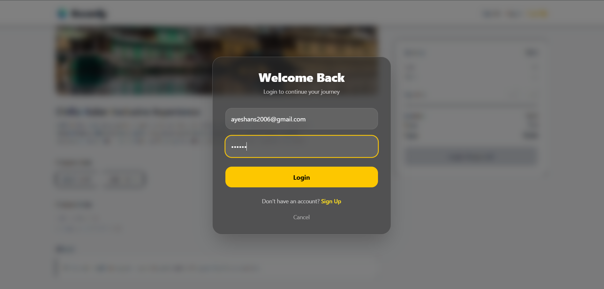

---

### 📅 Slot Booking
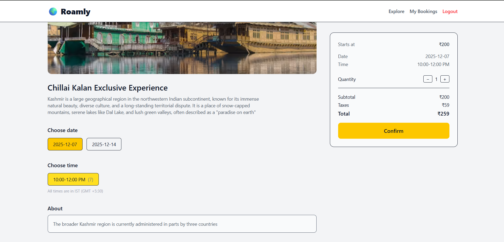

---

### 💳 Razorpay Checkout
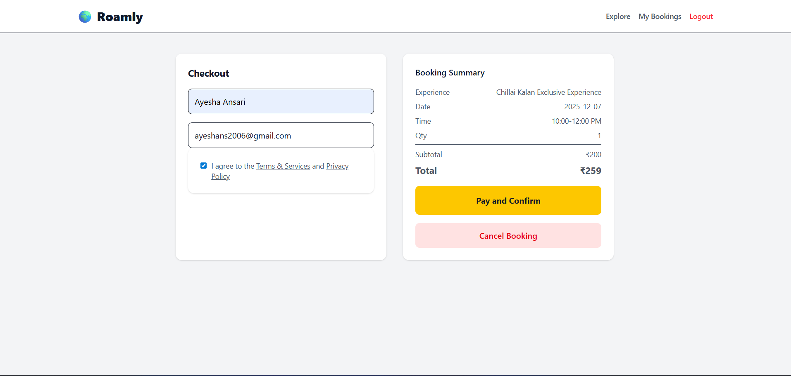

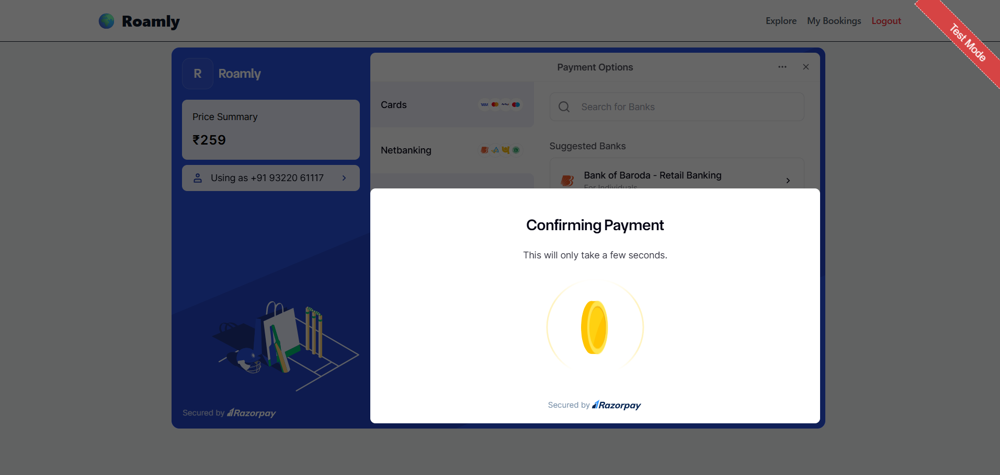

---

### 📂 My Bookings
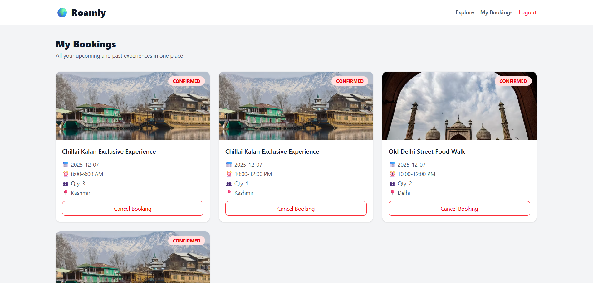

---

## 🛠️ Admin Side

### 🌍 Admin Explore
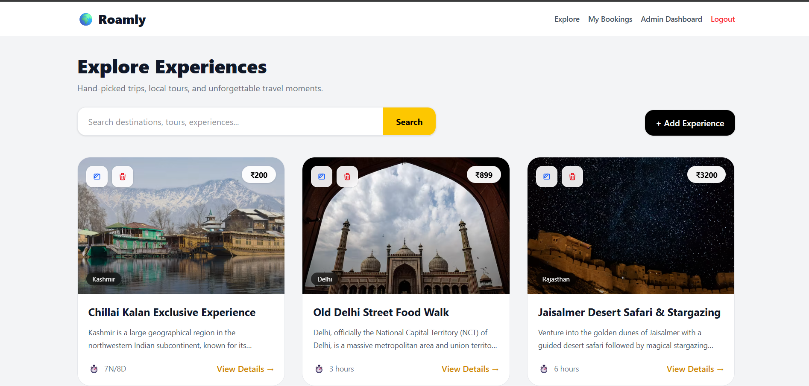

---

### ➕ Add Experience
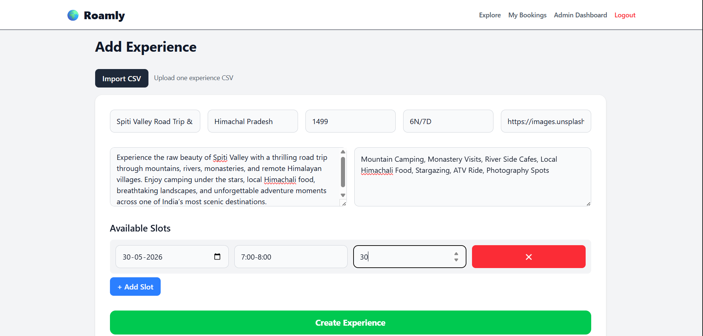

---

### ✏️ Edit Experience
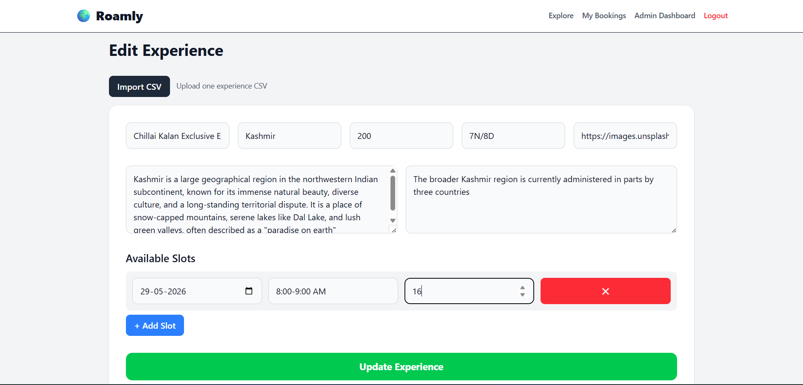

---

### 📊 Admin Dashboard
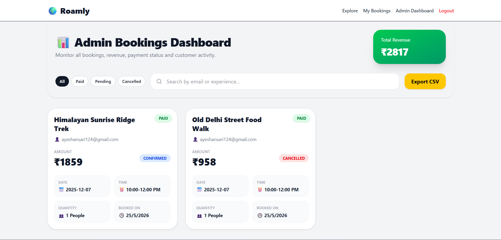

---

## 🧠 What I Learned

- Authentication and session management
- Payment gateway integration
- Slot booking logic
- CSV import/export handling
- MVC architecture
- MongoDB schema design
- Building admin dashboards
- Real-world booking workflows

---

## 💡 Future Improvements

- Email confirmations
- Reviews and ratings
- Google OAuth
- Wishlist system
- Maps integration

---

## 👩‍💻 Author

**Ayesha Ansari**

Built with ❤️ using Node.js, Express.js, MongoDB, EJS, and Razorpay